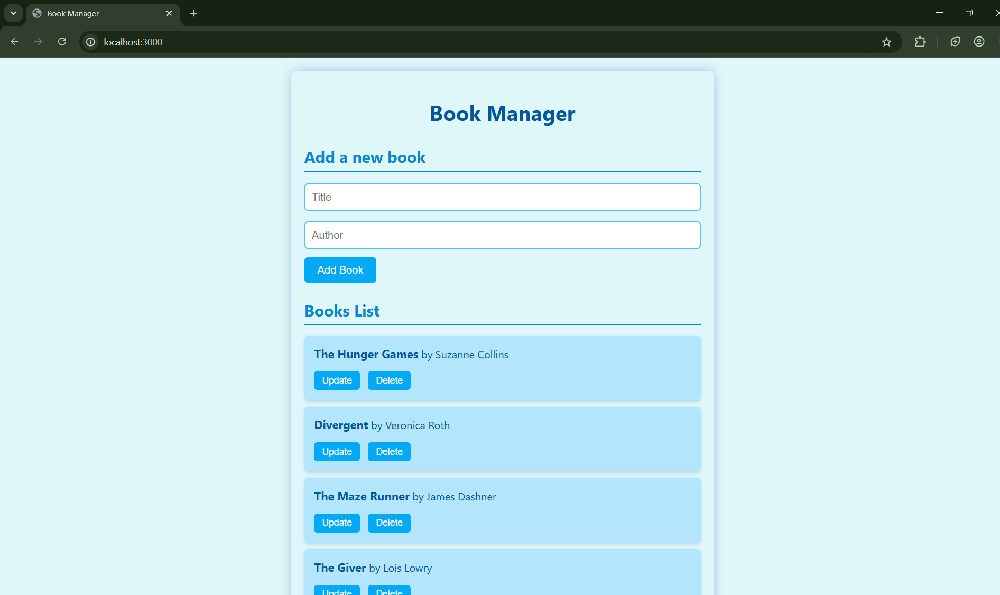

# 📚 Book Manager (Node + Express + HTML/CSS - RestAPI)

A simple full-stack web app to manage a list of books. Built with **Node.js**, **Express.js**, and a **frontend using HTML, CSS, and JavaScript**. It supports basic **CRUD operations** (Create, Read, Update, Delete) on books via a REST API and a user-friendly interface.

---

## 🚀 Features

- ✅ View all books
- ➕ Add new books
- 📝 Edit existing books
- ❌ Delete books
- 🌐 REST API (Node + Express)
- 🎨 Sky blue themed user interface

---

## 🛠️ Technologies Used

- Node.js
- Express.js
- HTML / CSS / JavaScript
- REST API
- Postman (for API testing)

---

## 📁 Project Structure  
book-manager/  
├── public/  
│ ├── index.html # Frontend UI  
│ └── styles.css # Sky blue theme styling  
├── index.js # Express server (backend API)  
├── package.json # Project config and dependencies  
└── README.md # Project instructions (this file)  

---

##Server will run at: http://localhost:3000

---

## 📌 TODO (For Improvement)
-- Save books to a JSON file or database
-- Add search and filter
-- Improve form validation
-- Make layout responsive for mobile  

---

